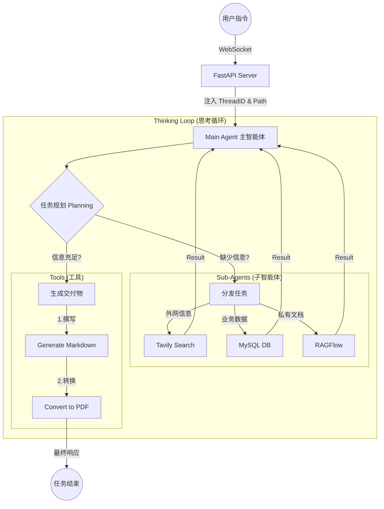

# Deep Search 深度搜索智能体

基于 DeepAgents 框架开发的智能深度搜索系统，通过协调多个专业子智能体完成复杂信息检索与文档生成任务。

## 项目概述

Deep Search 是一个企业级智能搜索解决方案，采用多智能体协作架构，能够：

- 🔍 **网络搜索** - 从互联网获取公开信息
- 🗄️ **数据库查询** - 查询企业 MySQL 数据库中的业务数据
- 📚 **知识库检索** - 通过 RAGFlow 访问企业内部知识库
- 📄 **文档生成** - 自动生成 Markdown、PDF 格式报告

## 技术架构

```
┌─────────────────────────────────────────────────────────────────┐
│                        Frontend (Vue 3)                         │
│                     http://localhost:5173                       │
└─────────────────────────────┬───────────────────────────────────┘
                              │ WebSocket + HTTP
┌─────────────────────────────▼───────────────────────────────────┐
│                      FastAPI Backend                            │
│                     http://localhost:8000                       │
│  ┌──────────────────────────────────────────────────────────┐  │
│  │                    Main Agent                              │  │
│  │              (DeepAgents + LangGraph)                      │  │
│  └─────────────────────────┬────────────────────────────────┘  │
│                            │                                      │
│       ┌────────────────────┼────────────────────┐               │
│       ▼                    ▼                    ▼               │
│ ┌─────────────┐     ┌─────────────┐     ┌─────────────┐        │
│ │ Network     │     │ Database    │     │ RAGFlow     │        │
│ │ Search      │     │ Query       │     │ Knowledge   │        │
│ │ Agent       │     │ Agent       │     │ Base Agent  │        │
│ └──────┬──────┘     └──────┬──────┘     └──────┬──────┘        │
│        │                  │                   │                │
│        ▼                  ▼                   ▼                │
│   Tavily API         MySQL 8           RAGFlow SDK            │
└─────────────────────────────────────────────────────────────────┘
```

## 项目结构

```
deep-search/
├── agent/                     # 智能体核心模块
│   ├── main_agent.py         # 主智能体（协调者）
│   ├── llm.py                # 大模型配置
│   ├── prompts.py            # 提示词管理
│   └── subagents/            # 子智能体
│       ├── network_search_agent.py    # 网络搜索助手
│       ├── db_query_agent.py          # 数据库查询助手
│       └── knowledge_base_agent.py     # RAGFlow知识库助手
├── api/                      # FastAPI 服务
│   ├── server.py             # API 服务入口
│   ├── monitor.py            # WebSocket 监控
│   └── context.py            # 会话上下文管理
├── tools/                    # 工具集
│   ├── db_tools.py           # 数据库操作工具
│   ├── markdown_tools.py     # Markdown 生成工具
│   ├── pdf_tools.py         # PDF 转换工具
│   ├── ragflow_tools.py     # RAGFlow 集成工具
│   └── tavily_tool.py       # 联网搜索工具
├── ui/                       # Vue 3 前端项目
│   └── src/
│       ├── App.vue           # 主应用组件
│       └── components/       # UI 组件
├── prompt/                   # 提示词配置
│   └── prompts.yaml          # YAML 格式提示词
└── output/                   # 生成的文档输出目录
```

## 业务流程

```
┌─────────────┐
│  User Query │  用户输入自然语言查询
└──────┬──────┘
       │
       ▼
┌─────────────────────────────────────────────────────────────┐
│                    Main Agent                                 │
│  1. 分析用户意图                                             │
│  2. 规划任务步骤 (生成 TODO-List)                            │
│  3. 协调子智能体执行任务                                     │
│  4. 整合结果并生成回复                                       │
└──────┬──────────────────────────────────────────────────────┘
       │
       ▼
┌─────────────────────────────────────────────────────────────┐
│                   Sub-agents Execution                        │
│                                                              │
│  ┌───────────────┐  ┌───────────────┐  ┌───────────────┐   │
│  │   Network     │  │   Database    │  │   RAGFlow     │   │
│  │   Search      │  │   Query       │  │   Knowledge   │   │
│  │   Agent       │  │   Agent       │  │   Base Agent  │   │
│  └───────┬───────┘  └───────┬───────┘  └───────┬───────┘   │
│          │                   │                   │           │
│          ▼                   ▼                   ▼           │
│     Tavily API          MySQL 8            RAGFlow          │
│                                                              │
└──────────────────────────────────────────────────────────────┘
       │
       ▼
┌─────────────────────────────────────────────────────────────┐
│                    Result Output                              │
│                                                              │
│  ┌─────────────────┐  ┌─────────────────┐  ┌──────────────┐ │
│  │  Direct Answer  │  │  Markdown File  │  │  PDF File    │ │
│  │  (Text)         │  │  (.md)           │  │  (.pdf)      │ │
│  └─────────────────┘  └─────────────────┘  └──────────────┘ │
└──────────────────────────────────────────────────────────────┘
```





## 快速开始

### 环境要求

- Python 3.10+
- Node.js 18+
- MySQL 8.0+
- RAGFlow 服务（可选）

### 安装依赖

```bash
# Python 依赖
pip install -r requirements.txt

# 前端依赖
cd ui && npm install
```

### 配置环境变量

创建 `.env` 文件：

```env
# OpenAI API 配置
OPENAI_API_KEY=your_api_key
OPENAI_BASE_URL=https://api.openai.com/v1

# MySQL 数据库配置
MYSQL_HOST=localhost
MYSQL_PORT=3306
MYSQL_USER=root
MYSQL_PASSWORD=your_password
MYSQL_DATABASE=your_database

# RAGFlow 配置（可选）
RAGFLOW_API_KEY=your_ragflow_key
RAGFLOW_BASE_URL=http://localhost:9380

# Tavily 搜索配置（可选）
TAVILY_API_KEY=your_tavily_key
```

### 启动服务

```bash
# 1. 启动后端 API 服务
python -m api.server

# 2. 启动前端开发服务器（可选）
cd ui && npm run dev
```

### API 接口

| 接口 | 方法 | 说明 |
|------|------|------|
| `/api/task` | POST | 启动智能体任务 |
| `/api/upload` | POST | 文件上传 |
| `/api/ws` | WebSocket | 实时任务进度订阅 |

## 核心功能说明

### 1. 多智能体协作

系统包含一个主智能体和三个专业子智能体：

- **主智能体 (Main Agent)** - 任务协调者，负责规划和整合
- **网络搜索助手** - 使用 Tavily API 进行联网搜索
- **数据库查询助手** - 连接 MySQL 执行 SQL 查询
- **RAGFlow 助手** - 查询企业内部知识库

### 2. 文档生成

支持自动生成以下格式的文档：

- **Markdown** - 结构化文档
- **PDF** - 可打印报告

### 3. 实时进度监控

通过 WebSocket 实现任务的实时进度推送，包括：

- 子智能体调用状态
- 工具执行日志
- 任务完成通知

## 技术栈

### 后端

- **框架**: FastAPI + DeepAgents (LangChain/LangGraph)
- **数据库**: MySQL 8
- **LLM**: OpenAI GPT 系列

### 前端

- **框架**: Vue 3 + TypeScript
- **构建工具**: Vite
- **HTTP 客户端**: Axios

### 智能体

- **框架**: DeepAgents
- **编排**: LangGraph
- **提示词管理**: YAML

## License

MIT License
